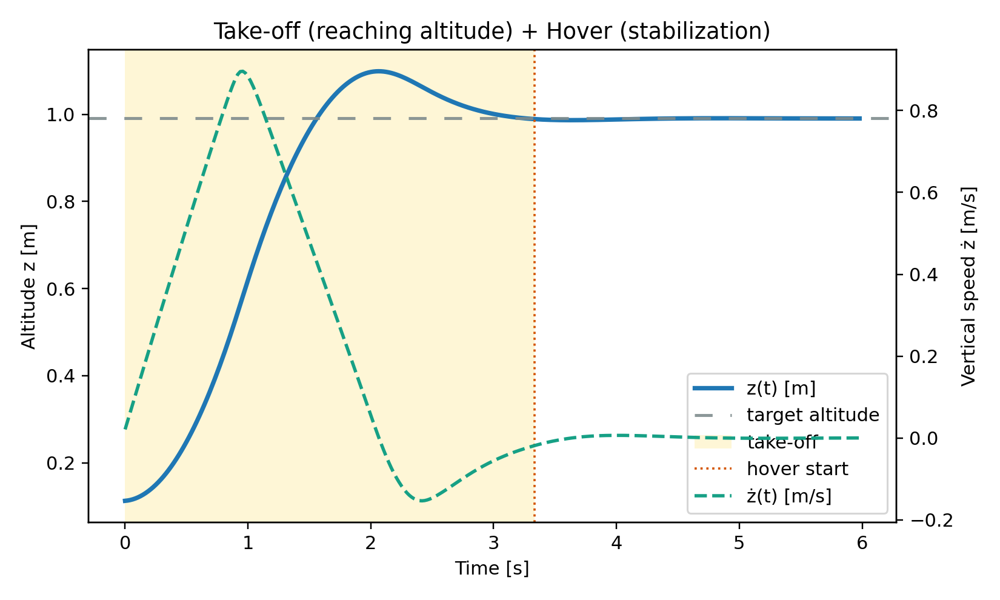

# Learning To Fly

<p align="center">
  <a href="https://www.python.org/">
    
  </a>
  <a href="https://github.com/DLR-RM/stable-baselines3">
    
  </a>
  <a href="https://pybullet.org/wordpress/">
    
  </a>
  <a href="https://www.gymlibrary.dev/">
    
  </a>
</p>

This guide consolidates the steps and changes needed to reproduce **Task 1 — Single‑Agent Take‑off and Hover** from the paper *“Learning to Fly — a Gym Environment with PyBullet Physics for Reinforcement Learning of Multi‑agent Quadcopter Control”* (IROS 2021). It explains how to create the environment, lists dependencies, and documents how the repository was reorganized to run training/testing with experiment tracking.

> **Primary platform**: this project was developed and tested primarily on **Windows** using **Anaconda** (Conda env `drones`). The steps are cross‑platform; Linux/macOS/WSL also work when OpenGL is available.
>
> The original IROS‑2021 code lives on the repository’s `paper` branch, which is intended for reproducing the paper’s results.


---

## Environment Setup (Windows + Anaconda)

### Quick start
```bash
# 1) Clone the original repo at the paper branch
git clone -b paper https://github.com/utiasDSL/gym-pybullet-drones.git
cd gym-pybullet-drones

# 2) Install in editable mode
pip3 install -e .
```

### Optional: create an isolated env (recommended)
Conda/mamba or venv are fine; here’s a minimal example:
```bash
# with conda
conda create -n drones python=3.10 -y
conda activate drones
# then run: pip3 install -e .
```

**Notes**
- GUI rendering requires a working OpenGL stack and up‑to‑date GPU drivers.
- For headless machines, you can run evaluation without a GUI.
- On Windows, use **Anaconda Prompt**; WSL is also supported if OpenGL forwarding is configured.


---

## Dependencies

You can pin the key packages in a `requirements.txt` (example below), then run `pip install -r requirements.txt` *before* `pip3 install -e .` if you prefer stricter versioning.

```text
# Core dependencies for drone RL training and testing 
gym==0.21.0
stable-baselines3[extra]==1.7.0
torch>=1.11.0
numpy>=1.21.0
matplotlib>=3.5.0
wandb>=0.13.0


# install gym-pybullet-drones separately with: pip3 install -e .
# (it brings PyBullet as a dependency)

```


---

## Repository layout (as used here)

The root of the project is organized like this:

```
.
├─ gym_pybullet_drones/
├─ results/                # saved models, logs, evaluations
├─ wandb/                  # Weights & Biases runs
├─ singleagent.py          # training (PPO/SAC/A2C) + wandb
└─ test_singleagent.py     # testing/comparison + wandb
```

> The above mirrors the structure shown in the provided screenshot.


---

## Training: Single‑agent Take‑off / Hover

> **Tasks**: use `--env takeoff` for the take‑off stabilization task and `--env hover` for the single‑drone hover task. Kinematic observations (`--obs kin`) and `one_d_rpm` actions are a robust starting point.

Train a specific algorithm (examples):
```bash
# PPO on Hover
python singleagent.py --env hover --algo ppo --obs kin --act one_d_rpm --cpu 1

# SAC on Takeoff
python singleagent.py --env takeoff --algo sac --obs kin --act one_d_rpm --cpu 1

# A2C on Hover
python singleagent.py --env hover --algo a2c --obs kin --act one_d_rpm --cpu 1
```

Train all three (PPO, SAC, A2C) in one go:
```bash
python singleagent.py --env hover --obs kin --act one_d_rpm --cpu 1 --compare_all
```

Use a custom Weights & Biases project:
```bash
python singleagent.py --env hover --algo ppo --project "my-drone-experiments"
```

### CLI flags (training)

| Flag | Type / Choices | Meaning | Default |
|---|---|---|---|
| `--env` | `takeoff`, `hover` | RL task/environment | `hover` |
| `--algo` | `a2c`, `ppo`, `sac` | RL algorithm | *(required unless `--compare_all`)* |
| `--obs` | `kin`, `rgb` | Observation type (Kinematic or RGB) | `kin` |
| `--act` | `rpm`, `dyn`, `pid`, `vel`, `tun`, `one_d_rpm`, `one_d_dyn`, `one_d_pid` | Action space (**1D variants recommended for `takeoff`/`hover`**) | `one_d_rpm` |
| `--cpu` | int | Parallel environments (`sac` effectively uses 1) | `1` |
| `--project` | str | Wandb project name | `drone-rl-comparison` |
| `--compare_all` | flag | Train PPO, SAC, A2C sequentially | `False` |
| `--seed` | int | Reproducibility (`-1` disables) | `-1` |
| `--n_steps` | int | On‑policy rollout length per env (A2C/PPO only) | `None` |

**Internal constants (for reference)**  
`TOTAL_TIMESTEPS=35000`, `EVAL_FREQ_DIVISOR=2000`, `AGGR_PHY_STEPS=5`, `EPISODE_REWARD_THRESHOLD=-0.0`.


---

## Testing & Evaluation

> The testing script is located at the repository root (see layout above). In the commands below, use the placeholder `<TEST_SCRIPT>.py` to refer to it.

### Naming convention for experiment folders
Trained runs are saved under `results/` using this pattern:
```
save-<ENV>-<ALGO>-<OBS>-<ACT>-<TIMESTAMP>/
```
Examples: `save-hover-ppo-kin-one_d_rpm-01.01.2024_10.30.45/`

### Evaluate one experiment (headless or GUI)
```bash
# Headless evaluation over N episodes
python <TEST_SCRIPT>.py --exp ./results/save-<ENV>-<ALGO>-<OBS>-<ACT>-<TIMESTAMP> --n_episodes 10 --headless

# Force GUI (overrides --headless) and run a short visual demo
python <TEST_SCRIPT>.py --exp ./results/save-<ENV>-<ALGO>-<OBS>-<ACT>-<TIMESTAMP> --gui --visual_duration 6
```

### Batch‑compare multiple experiments
```bash
# Test and compare every matching run under ./results
python <TEST_SCRIPT>.py --exp_dir ./results --pattern "save-<ENV>-*-<OBS>-<ACT>-*"
```

### CLI flags (testing)

| Flag | Type / Choices | Meaning | Default |
|---|---|---|---|
| `--exp` | path | Path to a single experiment directory | — |
| `--exp_dir` | path | Directory containing multiple experiments | — |
| `--pattern` | str | Glob to match experiment folders (e.g., `save-*`) | `save-*` |
| `--n_episodes` | int | Number of evaluation episodes | `10` |
| `--headless` | flag | Disable GUI & visual demo | `False` |
| `--gui` | flag | Force GUI on (overrides `--headless`) | `False` |
| `--visual_duration` | int | Seconds to render per visual demo | `6` |
| `--deterministic` / `--stochastic` | flag | Deterministic vs. stochastic policy at eval | `deterministic` |
| `--seed_base` | int | If set, episode seed = `seed_base + i` | `None` |
| `--project` | str | Wandb project for testing logs | `drone-rl-testing` |


---

## Weights & Biases

```bash
pip install wandb           # if not already installed
wandb login                 # paste your API key from https://wandb.ai/authorize
```
During training/testing the scripts log rewards, episode lengths, losses, evaluation stats, and comparison tables/plots.


---

## Task Overview

This section contains my **reproduction** of Task 1 "Single Agent Take‑off and Hover".


The goal is to compare **A2C**, **PPO**, and **SAC** on the simplified **kinematics** observation model with **ONE\_D\_RPM** action (thrust along body-z), using **default SB3 hyperparameters** and a **shared MLP** backbone, closely mirroring the paper’s setup.


Take off and **hover** at a fixed set-point. The reward is the **negative squared Euclidean distance** to the set-point (best ≈ **0** when the agent perfectly tracks the target at every step).

**Protocol**  
- **Training budget**: **35,000 timesteps**  
- **Evaluation**: periodic runs on a fixed test battery 
- **Seed:** fixed per run (I used 98 in this experiment)

---
## Demo: Take-off & Hover 

This demo illustrates the target behavior of **Task 1**: starting from rest near the ground, the quadrotor must **climb to a commanded altitude** (the set-point $z^\star$) and then **hold that altitude** stably. 

**What to look for in the demo**
- A **smooth climb** (short rise time), **small overshoot**, and **fast settling** into the hover band.
- During hover, altitude oscillations should be small and the vertical speed should fluctuate around zero.


**A successful rollout has two phases:**

- **Take-off (transient):** accelerate upward, reach the neighborhood of $z^\star$ quickly, with limited **overshoot**.
- **Hover (steady state):** remain close to $z^\star$ with near-zero vertical speed.  
  In this plot, the **hover band** is entered once, for at least $0.5\,\mathrm{s}$, both $|z - z^\star| \le 1.5\,\mathrm{cm}$ and $|\dot{z}| \le 0.02\,\mathrm{m/s}$.



*Controller used in the clip.*  
In this illustration is used the policy that ranked **best in evaluation** (SAC; see *Results* for the full comparison).  


---
## Results

### Learning curves 


- **Ordering**: **SAC (green) > PPO (red) > A2C (purple)** across most of training.
- **Stability**: A2C shows occasional sharp drops; PPO is moderately stable; SAC is the most stable.
- **Interpretation**: Moving upward (toward 0) means better tracking/hovering. Exact 0 is a theoretical upper bound.

*Note:* The **A2C** values occasionally fall outside the zoomed y-range and therefore do not appear in this panel.


> For completeness, the *running best* is also provided:  


### Final test performance

Two compact summaries:

- **Mean Episode Reward per Algorithm**  
  

- **Episode Reward Summary (best/mean/worst)**  
  

**Takeaway at the fixed budget:** SAC has the **highest** mean reward (closest to 0), PPO is **second**, A2C is **third** and more variable.

### Compute cost


- **SAC** takes **significantly longer** wall‑clock time at the same 35k steps (expected for an off‑policy method with more gradient updates per sample).  
- **PPO**/**A2C** are considerably faster to train.

---


## Conclusions


- **Alignment:** The **qualitative ranking** (**SAC > PPO > A2C**) and the **relative stability** match the paper’s message for Task 1: **SAC performs best**, **PPO** is a competitive second, and **A2C** is more **unstable** without hyperparameter tuning.  

- **Spikes** are expected in RL due to environment randomness, policy stochasticity, and limited evaluation batches.

- **Practical trade‑off:** SAC achieves the best control quality **at a higher compute cost**; PPO offers a solid quality‑time compromise; A2C is fastest but less reliable.  

---

## References

- **Paper (IROS 2021)**  
  J. Panerati, H. Zheng, S. Zhou, J. Xu, A. Prorok, A. P. Schoellig.  
  *Learning to Fly — a Gym Environment with PyBullet Physics for Reinforcement Learning of Multi-agent Quadcopter Control.* IROS 2021.  
  DOI: https://doi.org/10.1109/IROS51168.2021.9635857 • PDF (arXiv): https://arxiv.org/abs/2103.02142

- **Environment repository**  
  **utiasDSL/gym-pybullet-drones** — original codebase for the paper.  
  GitHub: https://github.com/utiasDSL/gym-pybullet-drones  
  Docs: https://utiasdsl.github.io/gym-pybullet-drones/  
  Branch for the IROS’21 release: `paper`

- **Stable-Baselines3 (RL library)**  
  Docs: https://stable-baselines3.readthedocs.io/  
  GitHub: https://github.com/DLR-RM/stable-baselines3  
  Paper (JMLR): https://jmlr.org/papers/volume22/20-1364/20-1364.pdf

- **PyBullet (physics engine)**  
  Website: https://pybullet.org/  

